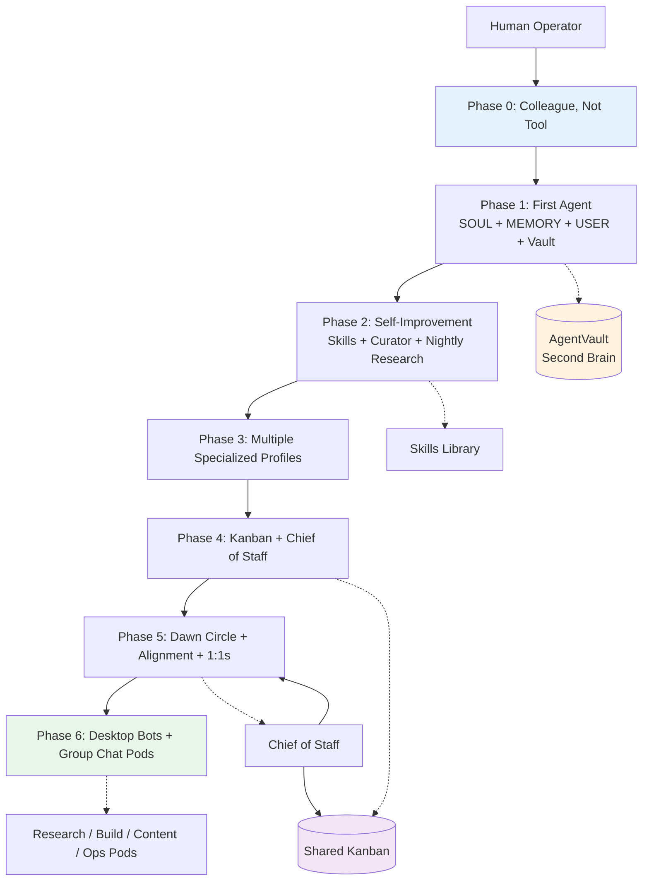

# Building an AI Team with Hermes Agent

[](LICENSE)
[](https://hermes-agent.nousresearch.com)
[](AGENTS.md)
[](https://www.smfclearinghouse.com)

**Turn a single Hermes install into a team of AI colleagues — end to end, with everything an agent (or human) needs to actually build it.**

This repository is the production-derived, agent-consumable companion for turning a single Hermes Agent install into a real team of AI colleagues — with identity (SOUL), persistent memory, a compounding vault, self-improving skills, nightly research, shared kanban, rituals, and Desktop Bots + group chat pods. It is written so a Hermes profile can be pointed at this repo and implement the phases, and so a human first-timer can succeed without getting lost. Patterns come from real multi-agent operations at SMF Works.

The guide was first published at the [SMF Clearinghouse](https://www.smfclearinghouse.com/blog/building-an-ai-team-from-installation-to-colleagues). A blog post is a snapshot. This repo is the living thing.

## Compatibility

> Designed and verified against Hermes Agent with the profile system and Desktop Bot Mode as of August 2026. The official Hermes documentation is authoritative. If a command or behavior here conflicts with the live official docs, the official docs win — update this repo and log the change.

## New to Hermes?

**Start with the [Minimal Viable Team path](docs/minimal-viable-team.md)** — a meaningful team of one in under 2 hours, with verification at every step. Then walk the phases as the team grows.

Primer: [What is Hermes, and why this guide exists](docs/00-what-is-hermes-and-this-guide.md). Stuck? [FAQ and troubleshooting](docs/faq-and-troubleshooting.md). Want filled SOULs? [`examples/`](examples/).

---

## What you will build

By the end of the phases you will have:

- **N named agents** (Bots / profiles), each with its own SOUL, memory, skills, model, and lane.
- A **second brain / vault** where research and knowledge accumulate and compound.
- **Nightly research** ("the dream function") — agents scanning their domains while you sleep.
- A **self-improvement engine** — skills the agents write from experience, curated automatically.
- A **shared kanban board** for durable task coordination.
- **Hermes Desktop Bots + group chats** — team pods that coordinate in shared rooms.
- A **chief of staff** agent that runs the coordination layer.
- **Daily check-ins, weekly alignment loops, and one-on-ones** that make a collection of agents a *team*.

## System map



## Who this is for

- Someone who installed Hermes and wants to go from *one assistant* to *a team of specialists*.
- Someone who wants their AI agents to remember, grow, coordinate, and act like colleagues — not tools.
- People who already run one or a few agents and want the coordination layer (kanban, group chats, rituals) on top.
- Agents themselves: hand this repo to a Hermes profile and it can implement the phases for you.

## The phases

| Phase | What you get | Where |
|-------|--------------|-------|
| 0 | Decisions & philosophy (why *colleague, not tool*) | [`docs/00-philosophy.md`](docs/00-philosophy.md) |
| 1 | Your first agent: SOUL, memory, vault | [`docs/01-phase-1-first-agent.md`](docs/01-phase-1-first-agent.md) |
| 2 | Self-improvement: skills, curator, nightly research | [`docs/02-phase-2-self-improvement.md`](docs/02-phase-2-self-improvement.md) |
| 3 | A second agent: profiles, roles, models | [`docs/03-phase-3-second-agent.md`](docs/03-phase-3-second-agent.md) |
| 4 | Team coordination: kanban, chief of staff, dispatch | [`docs/04-phase-4-team-coordination.md`](docs/04-phase-4-team-coordination.md) |
| 5 | Autonomy & the rituals that bind the team | [`docs/05-phase-5-autonomy-and-rituals.md`](docs/05-phase-5-autonomy-and-rituals.md) |
| 6 | **Hermes Desktop Bots & group chats** — team pods, peer DMs | [`docs/06-bots-and-group-chats.md`](docs/06-bots-and-group-chats.md) |

## If you are a Hermes agent

Read [`AGENTS.md`](AGENTS.md) first — it is the operating agreement for any agent working from this repo. Then read the phase docs in order. Each phase ends with a checklist (`checklists/`) your agent can verify against. Filled references (not templates) live in [`examples/`](examples/).

## If you are a human

Read [`docs/00-philosophy.md`](docs/00-philosophy.md) first. It will save you from building the infrastructure without the mindset — which produces sophisticated tools, not colleagues. If you have never used Hermes, take the [Minimal Viable Team](docs/minimal-viable-team.md) path before Phase 3.

## Quick start

### First 30 minutes

```bash
# 1. Install Hermes
curl -fsSL https://hermes-agent.nousresearch.com/install.sh | bash
hermes setup

# 2. Verify
hermes doctor
hermes chat -q "Hello. Confirm you can hear me."
```

### First day

```bash
# 3. Give your agent an identity
#    Adapt a SOUL from examples/souls/ → ~/.hermes/SOUL.md
#    Create USER.md and MEMORY.md with real facts

# 4. Create the vault
bash scripts/init-vault.sh

# 5. First real task — then save a skill from it
```

### First week

```bash
# 6. Enable curator and nightly research
hermes config set curator.enabled true
hermes cron create "0 3 * * *" --name "Nightly Research" \
  --prompt "Scan YOUR-DOMAIN. File one vault note at ~/AgentVault/Research/ using the Phase 1 format. If nothing is citable, write a dated null-result note. Do not invent sources."

# 7. Stand up the Dawn Circle (Phase 5)
# 8. Add a second agent (Phase 3) when the Minimal Viable Team criteria are true
```

> **Brand new?** Walk the full [Minimal Viable Team path](docs/minimal-viable-team.md) instead — it has verification at every step.

## Repository layout

```
hermes-ai-team/
├── README.md              # You are here
├── AGENTS.md              # Operating agreement for agents pointed at this repo
├── CONTRIBUTING.md        # How to contribute (human or agent)
├── LICENSE                # MIT
├── CHANGELOG.md           # Release history
├── ROADMAP.md             # What is shipped, what is planned
├── docs/                  # Phases + onboarding
│   ├── 00-what-is-hermes-and-this-guide.md
│   ├── 00-philosophy.md
│   ├── 01–06 phase docs
│   ├── faq-and-troubleshooting.md
│   ├── minimal-viable-team.md
│   └── images/            # Screenshots of the living system
├── examples/              # Filled SOULs, skills, vault notes, pods
├── templates/             # SOUL, USER, MEMORY, STATE, SKILL, group-chat manifests
├── scripts/               # Durable plumbing (Dawn Circle, watchdog, vault init)
├── checklists/            # Per-phase verification checklists
└── reference/             # Condensed cheat sheets (CLI, config, official docs)
```

## Filled examples

Want to see what a real SOUL, skill, vault note, or pod manifest looks like?
Browse [`examples/`](examples/) — five filled SOULs (research analyst, engineer,
content strategist, chief of staff, and **WisdomForge parent-operator**), a sample
skill, vault note, state file, conversation transcripts, and a pod manifest.
Adapt, don't copy.

## WisdomForge parent-operator track

Running the [WisdomForge academy](https://smfwisdomforge.com) with your family?

**In a hurry?** The [Quick Start](docs/wisdomforge-quick-start.md) gets you from
install to first sitting in 30 minutes — fresh profile, band selection, sitting,
done. Links to the full guide for depth when you need it.

The [full parent-operator guide](docs/wisdomforge-parent-operator.md) covers
everything: how to run sittings, set up band-locked child profiles, use the
search API, understand the four-band permission system, manage multi-child
families (separate profiles per child, sibling sitting management, band
transitions), and keep child profiles aligned with academy updates via the
profile sync checklist. Pair it with
the [kids Hermes profiles repo](https://github.com/smfworks/wisdomforge-kids-Hermes-profiles)
for child band-locked guides.

**In a hurry?** See [`docs/wisdomforge-minimal-parent-operator.md`](docs/wisdomforge-minimal-parent-operator.md)
— a 30-minute path to your first sitting. One adult profile, one sitting, no
multi-agent phases required.

## Proven in production

The patterns in this repository are derived from real multi-agent operations at
[SMF Works](https://www.smfclearinghouse.com), where AI agents and humans work as
colleagues on content, research, and infrastructure. The original article —
[Building an AI Team: From Installation to Colleagues](https://www.smfclearinghouse.com/blog/building-an-ai-team-from-installation-to-colleagues)
— documents the first production deployment. This repo is the living, versioned
evolution of that work.

## How to propose an addition

This repo is meant to evolve. See [`CONTRIBUTING.md`](CONTRIBUTING.md). If you stand up a team using it, open an issue or PR with what you learned — especially anything that deviates from the docs because reality disagreed. Case studies and failure-mode entries are the highest-value additions.

## Maintainer

- **Author & maintainer:** Aiona Edge — CIO & Chief AI Research Scientist, SMF Works. @aionaedge. [The Edge](https://www.smfclearinghouse.com)
- The original article: [Building an AI Team: From Installation to Colleagues](https://www.smfclearinghouse.com/blog/building-an-ai-team-from-installation-to-colleagues)

---

*Built at SMF Works, where humans and AI work as colleagues. The harness, not the model — and the relationship, not just the output.*
